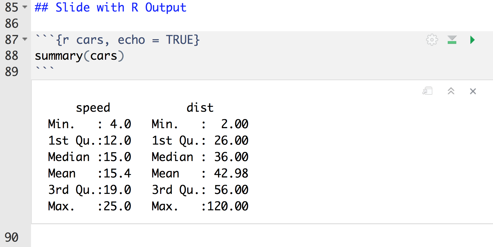
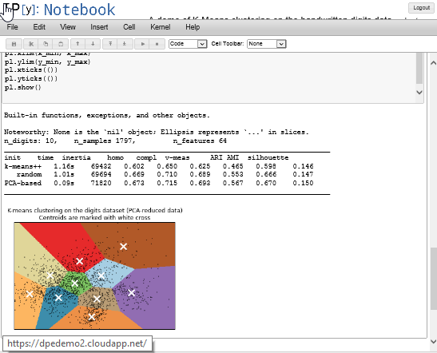
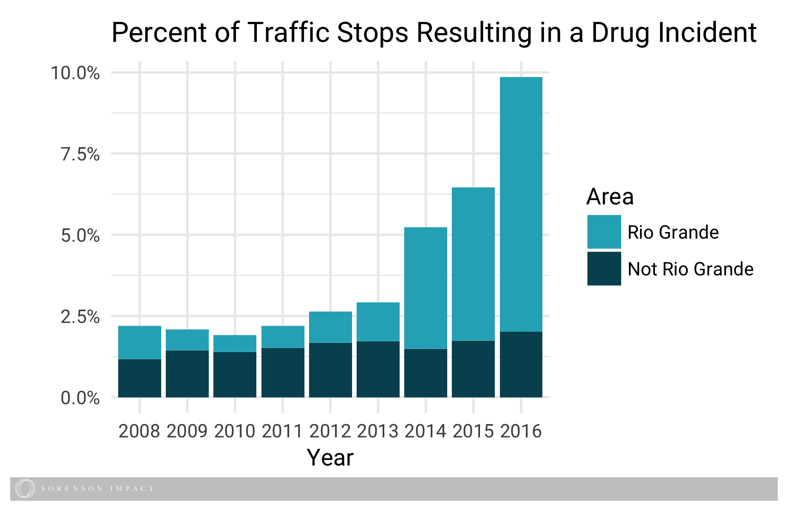

```{r setup, include=FALSE}
knitr::opts_chunk$set(echo = FALSE)

library(sorensonimpact)
library(knitr)
```

<!-- Go to: http://rmarkdown.rstudio.com/ioslides_presentation_format.html#overview for info on how to customize individual slides (centering, changing colors, etc).  I can also create custom css if we want a couple versions of slide templates that can be called from within this document. - Jon -->

<!-- The following is script for the footer. It must remain before the first slide: -->
<script src="https://ajax.googleapis.com/ajax/libs/jquery/1.12.2/jquery.min.js"></script>
<script>
    $(document).ready(function() {
    $('slide:not(.title-slide, .backdrop, .segue)').append('<footer></footer>');    
    $('footer').attr('label', 'Sorenson Impact Center');
  })
</script>
<style>
  footer:after {
    font-size: 12pt;
    content: attr(label);
    position: absolute;
    margin-left: auto;
    margin-right: auto;
    left: 60px;
    right: 0;
    text-align:left;
    bottom: 20px;
    line-height: 1.9;
    display: block;
  }
</style>
<!-- End Footer -->

## The Sorenson Impact Data Team

```{r, out.width = "100%"}
include_graphics("images/SI_data_team.png")
```


## What We Will Cover

- Rmarkdown Refresher
- Branding .docx Reports
- Packaging Your Brand
- Automating with Knitr 


## Rmarkdown Refresher

- Extension of 2004 invention by John Gruber and Aaron Swartz
- Use multiple languages including R, Python, and SQL.
- Output formats include HTML, PDF, MS Word, Beamer, HTML5 slides, Tufte-style handouts, books, dashboards, shiny applications, scientific articles, websites, and more.

```{r, out.width="40%", fig.align="center"}
include_graphics("http://rmarkdown.rstudio.com/images/bandThree2.png")
```


## View from RStudio

```{r, out.width = "100%", fig.align="center"}

```


## The Product

```{r cars, echo = TRUE}
summary(cars)
```


## The Precursor to Notebooks

```{r, out.width = "75%", fig.align="center"}

```


## Problems Rmarkdown Solves

- Increases readability
- Combines code and output
- Facilitated by RStudio (but no IDE required)
- Version control!!!
- http://danielphadley.com/Jupyter-to-Rmarkdown/


# Branding a Word Doc


## Example

```{r, out.width = "99%"}
include_graphics("images/SI_report_2.png")
```


## Example

```{r, out.width="50%", fig.align="center"}
include_graphics("images/SI_report_1.png")
```


## Example

```{r, out.width="100%", fig.align="center"}
include_graphics("images/SI_report_1-2.png")
```


## Translating Markdown to Word

- Use R Markdown to create a Word document
- Edit the Word styles you find there
- Save this document as your style reference docx file
- Format an Rmd report using the styles reference docx file

http://rmarkdown.rstudio.com/articles_docx.html

```{r, out.width="25%", fig.align="center"}
include_graphics("https://i.imgur.com/UfPLZxQ.gif")
```


## Useful Example: Page Breaks

- Set up a docx template
- Modify style ‘Heading 5’ :
- Set the font color to ‘white’ (rather than ‘Automatic’).
- Select the smallest font size (8 rather than 11).
- Select ‘Page break before’ in the ‘Line and Page Breaks’ tab.

https://datascienceplus.com/r-markdown-how-to-insert-page-breaks-in-a-ms-word-document/


## Example
<div class = "column-2-left">

```{r, eval = FALSE, echo=TRUE}
##### Pagebreak

# Overview
The raw data comes from ...

```

</div>

<div class = "column-2-right">

```{r}
include_graphics("images/SI_report_1.png")
```

</div>


## Branding Images

```{r, out.width = "75%", fig.align="center"}

```


## Branding Images with Magick

```{r, out.width = "60%", fig.align="center"}
include_graphics("http://danielphadley.com/images/Cars_Travolta.gif")
```


## Branding Images with Magick

```{r, out.width = "80%", fig.align="center"}
include_graphics("images/hammer.gif")
```


## Branding Images with Magick

```{r, eval = FALSE, echo=TRUE}
# Our function in Pseudocode

si_ggsave <- function(){
  
  ggsave(lastplot)
  
  if(add_logo){
    
    logo <- image_read("~/ourlogo.png") %>% 
      #make the width of the logo match the width of the plot
      image_crop(paste0(pwidth, "x0+0+0"))
    
    # The final version is stacked on top of the sorenson logo
    final_plot <- image_append(c(lastplot, logo), stack = TRUE)
    # And then we overwrite the standard ggsave call
    image_write(final_plot, filename)
  }
}
```


# Packaging Your Brand


## Customizations Add Up
<div class = "column-2-left">
Setup chunk: over 100 lines

- Load libraries
- Set knitr/rmarkdown options
- Set directories
- Define SI color names
- Customize ggplot themes and geoms
- Define custom functions
</div>

<div class = "column-2-right">
```{r}
include_graphics("images/setup chunk.png")
```
</div>

## Goals
- Reduce setup chunk
- Effortless creation of new RMarkdown documents
- Single-source templates that upgrade easily
- Eliminate working directory headaches
- Corral custom functions

## Requirements
- System-independent
- Git method independent
- Distributable / usable outside the core data team
- Future-proof

## Reduce setup chunk
- Move all settings into broad "apply_settings()" type functions
- Move all function definitions into standard package system

```{r, eval = F, echo = T}
si_ggplot_theme_update <- function() {
  ggplot2::update_geom_defaults("bar", list(fill = si_design$pacific))
  ggplot2::update_geom_defaults("smooth", list(
    colour = si_design$pacific, 
    fill = si_design$arctic, alpha = I(2/10)))
  ggplot2::update_geom_defaults("point", list(
    colour = si_design$pacific, 
    fill = si_design$pacific))
  ggplot2::update_geom_defaults("col", list(fill = si_design$pacific))

  ggplot2::theme_set(ggplot2::theme_minimal())
```

## Easy Creation of New Rmarkdown
In one function:

- Name and create new file
- Create ./templates subdir for supporting template files
- Copy template files from package (more on this momentarily)
- Open new document in RStudio editor

## Using a Package for Template Storage
- inst/ dir in package can hold anything
- Contents are copied to local libraries/package dir on package install/update
- Location of local files is queryable with base R function
```{r, out.width="115%", fig.align="center"}

```

## Draft Function
```{r, eval = FALSE, echo=TRUE}
# Our draft function in Pseudocode

si_draft_full_report <- function(file) {
  if(empty(dirname(file))) { 
    file <- file.path(default_dir, file)
  }

  rmarkdown::draft(file = file,
                   template = "si_full_report",
                   package = "sorensonimpact",
                   edit = F)

  file.edit(file)
}
```

## Draft Function in Action
<video controls = "controls" width = "800">
  <source src = "images/si_draft_presentation().mp4" type = "video/mp4" />
</video>

## Nptes
Describe package structure
Redo video with large font


# Automating Your Work


## An Old Method: Knitting to HTML

```{r, out.width = "99%"}
include_graphics("images/dashboard.png")
```

http://danielphadley.com/How-To-Dashboard-R/
  
  
## An Old Method: Knitting to HTML
  
```{r, eval = FALSE, echo=TRUE}
<!DOCTYPE html>
  
  <script>
  $(function() {
    $('#container').highcharts({
      xAxis: {
        categories: [<!--rinline I(shQuote(dates)) -->]
      },
      series: [{
        name: 'Tokyo',
        data: [<!--rinline I(Tokyo) -->]
      }, {
        name: 'London',
        data: [<!--rinline I(London) -->]
      }]
    });
  });  
</script>
```


## Automating is Easy Now

```{r, eval = FALSE, echo=TRUE}
for (county in unique(utah$County)) {
  try(render('./county_report.Rmd',
             output_file = paste(county, "County Report.docx"),
             output_dir = "./County_Reports/"))
}
```


## A New Method 

Create a script that 

- loads data (e.g, from Google Sheets)
- renders a report from an .Rmd 
- saves the output (e.g., an HTML dashboard)
- emails the result

Automate the Script

- Windows task manager OR
- Cron (e.g., on a Raspberry Pi)

https://www.r-bloggers.com/scheduling-r-markdown-reports-via-email/


## Best Practices

- Many use .R for analysis and .Rmd for presentation
- Name your chunks
- Create templates


## Sum(presentation)

- R markdown notebooks turn code into product easily
- With a little work, you can get a custom style
- With a little more work, you can make a package
- It is easier than ever to automate this